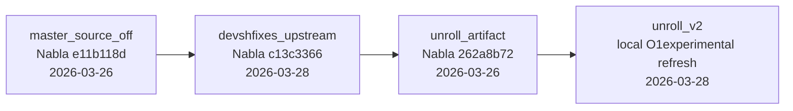

# Nabla Path Tracer runtime compare from Nsight Graphics

This directory contains one paired `Nsight Graphics` `GPU Trace` probe for Nabla Path Tracer.

Protocol:
- `1` run per variant
- same capture point: `frame 1000`
- same effective render path:
  - geometry: `sphere`
  - effective method: `solid angle`
- runtime numbers below come directly from `Nsight Graphics` exports:
  - `FRAME.xls`
  - `GPUTRACE_FRAME.xls`
- measurement machine:
  - [`measurement_machine.md`](measurement_machine.md)

## Variant matrix

| Case | Checkout source | Nabla | DXC | SPIRV-Headers | SPIRV-Tools | Mode |
| --- | --- | --- | --- | --- | --- | --- |
| `master_source_off` | `master_runcheck` local worktree | [`e11b118dd2e80393b5b7eb309c6abb25f51a818c`](https://github.com/Devsh-Graphics-Programming/Nabla/commit/e11b118dd2e80393b5b7eb309c6abb25f51a818c) | [`d76c7890b19ce0b344ee0ce116dbc1c92220ccea`](https://github.com/Devsh-Graphics-Programming/DirectXShaderCompiler/commit/d76c7890b19ce0b344ee0ce116dbc1c92220ccea) | [`057230db28c7f7d1d571c9e61732da44815f2891`](https://github.com/Devsh-Graphics-Programming/SPIRV-Headers/commit/057230db28c7f7d1d571c9e61732da44815f2891) | [`91ac969ed599bfd0697a5b88cfae550318a04392`](https://github.com/Devsh-Graphics-Programming/SPIRV-Tools/commit/91ac969ed599bfd0697a5b88cfae550318a04392) | local `Release`, `SOURCE`, runtime `builtins OFF` |
| `devshfixes_upstream` | `unroll_dxc_df_upstream_check` local worktree | [`c13c33662c3733b54d9014988a5ac602ab0c3245`](https://github.com/Devsh-Graphics-Programming/Nabla/commit/c13c33662c3733b54d9014988a5ac602ab0c3245) | [`74d6fbbad7388813c65ae269b20f15b4e971df9c`](https://github.com/Devsh-Graphics-Programming/DirectXShaderCompiler/commit/74d6fbbad7388813c65ae269b20f15b4e971df9c) | [`10b37414a3c9269b9bd8861cc759bd7fdf09760d`](https://github.com/Devsh-Graphics-Programming/SPIRV-Headers/commit/10b37414a3c9269b9bd8861cc759bd7fdf09760d) | [`2c75d08e3b31a673726ce6be80ab528250247064`](https://github.com/Devsh-Graphics-Programming/SPIRV-Tools/commit/2c75d08e3b31a673726ce6be80ab528250247064) | local `Release`, `SOURCE`, runtime `builtins OFF` |
| `unroll_artifact` | CI install artifact from [`run 23599197849`](https://github.com/Devsh-Graphics-Programming/Nabla/actions/runs/23599197849) | [`262a8b72f295ec95d3cf83170f1768a43972c9ab`](https://github.com/Devsh-Graphics-Programming/Nabla/commit/262a8b72f295ec95d3cf83170f1768a43972c9ab) | [`07f06e9d48807ef8e7cabc41ae6acdeb26c68c09`](https://github.com/Devsh-Graphics-Programming/DirectXShaderCompiler/commit/07f06e9d48807ef8e7cabc41ae6acdeb26c68c09) | [`c141151dd53cbd5b1ced0665ad95ae3e91e8f916`](https://github.com/Devsh-Graphics-Programming/SPIRV-Headers/commit/c141151dd53cbd5b1ced0665ad95ae3e91e8f916) | [`2a730e127a32ac8b0713f5e1490d7b9be9d1cc9a`](https://github.com/Devsh-Graphics-Programming/SPIRV-Tools/commit/2a730e127a32ac8b0713f5e1490d7b9be9d1cc9a) | CI `Release install` artifact |
| `unroll_v2` | `unroll_o1_local` local worktree after the latest `-O1experimental` changes | [`6ee8dbc04df55db97c9440d078eef160522a6af1`](https://github.com/Devsh-Graphics-Programming/Nabla/commit/6ee8dbc04df55db97c9440d078eef160522a6af1) | [`891d1d7bd6fb20757a3af07f5a7a33ef59f7c15e`](https://github.com/Devsh-Graphics-Programming/DirectXShaderCompiler/commit/891d1d7bd6fb20757a3af07f5a7a33ef59f7c15e) | [`c141151dd53cbd5b1ced0665ad95ae3e91e8f916`](https://github.com/Devsh-Graphics-Programming/SPIRV-Headers/commit/c141151dd53cbd5b1ced0665ad95ae3e91e8f916) | [`0ecbcc95a108f1a3313ea184260b10d21e158a47`](https://github.com/Devsh-Graphics-Programming/SPIRV-Tools/commit/0ecbcc95a108f1a3313ea184260b10d21e158a47) | local `RelWithDebInfo`, `SOURCE`, runtime `-O1experimental` |

## Legend

This report compares four checkpoints:
- `master_source_off`: current `master`-side baseline
- `devshfixes_upstream`: the same line after refreshing `devshFixes` with newer DXC upstream state
- `unroll_artifact`: that refreshed line plus the `unroll` PR work packaged in the published CI artifact
- `unroll_v2`: an up-to-date local measurement with the new `-O1experimental` flag after the latest `unroll`-line changes

## Runtime Probe

| Variant | GPU frame ms | Dispatch count | Compute active | SM throughput | PCIe write GB/s |
| --- | ---: | ---: | ---: | ---: | ---: |
| `master_source_off` | `21.4304` | `2` | `83.2501%` | `35.5388%` | `2.62710` |
| `devshfixes_upstream` | `19.6157` | `2` | `82.9923%` | `38.2916%` | `2.64694` |
| `unroll_artifact` | `21.5935` | `2` | `83.9945%` | `34.3346%` | `2.62212` |
| `unroll_v2` | `19.2360` | `2` | `86.9712%` | `38.7311%` | `2.64514` |

### Runtime deltas

| Comparison | Delta ms | Delta % |
| --- | ---: | ---: |
| `devshfixes_upstream` vs `master_source_off` | `-1.8147` | `-8.47%` |
| `unroll_artifact` vs `master_source_off` | `+0.1631` | `+0.76%` |
| `unroll_artifact` vs `devshfixes_upstream` | `+1.9778` | `+10.08%` |
| `unroll_v2` vs `master_source_off` | `-2.1944` | `-10.24%` |
| `unroll_v2` vs `devshfixes_upstream` | `-0.3797` | `-1.94%` |
| `unroll_v2` vs `unroll_artifact` | `-2.3575` | `-10.92%` |

## Cold startup Vulkan API probe

Cold startup `vkCreateComputePipelines` was measured on the same published runnable bundles with cleared pipeline/shader cache and Vulkan API tracing enabled for the process.

| Variant | `vkCreateComputePipelines` calls | `vkCreateComputePipelines` start->next sum ms |
| --- | ---: | ---: |
| `master_source_off` | `13` | `3737.11` |
| `devshfixes_upstream` | `21` | `3332.55` |
| `unroll_artifact` | `21` | `1418.86` |
| `unroll_v2` | `2` | `354.707` |

The cleanest comparison is `devshfixes_upstream` vs `unroll_artifact`, because both cold runs create exactly `21` compute pipelines. On that paired comparison the `vkCreateComputePipelines` batch drops from `3332.55 ms` to `1418.86 ms`, a reduction of about `57.4%`.

The `master_source_off` comparison is also informative: even though `unroll_artifact` creates more compute pipelines during cold startup (`21` vs `13`), the total `vkCreateComputePipelines` batch still drops from `3737.11 ms` to `1418.86 ms`, a reduction of about `62.0%`.

The new `unroll_v2` local measurement is the current up-to-date checkpoint after the latest `-O1experimental` changes. Against the published `unroll_artifact` cold run, the traced `vkCreateComputePipelines` batch drops further from `1418.86 ms` to `354.707 ms`, with the observed call count going from `21` to `2`. Against `master_source_off`, the same cold batch drops from `3737.11 ms` to `354.707 ms`.

## Main conclusion

The measured `latest upstream refresh` baseline is faster than `master_source_off` in this probe. At the same time `unroll_artifact` is effectively at parity with `master_source_off` here at only `+0.76%`, while the remaining gap appears only against `devshfixes_upstream`.

The up-to-date `unroll_v2` follow-up, measured with the new `-O1experimental` flag, goes further: in this probe it is now faster than `master_source_off` by `10.24%` on steady-state GPU frame time (`19.2360 ms` vs `21.4304 ms`), and its cold `vkCreateComputePipelines` batch is about `10.5x` smaller (`354.707 ms` vs `3737.11 ms`).

Taken together, the measured runtime cost points at the `unroll` side of the experiment, not at the generic `DXC/SPIRV-Tools upstream refresh`. That tradeoff is also aligned with the intent of the experiment: reduce shader build time aggressively while accepting a small runtime cost.

In practice this is also a strong argument for the new explicit `-O1experimental` path. For the Nabla Path Tracer builds behind this comparison the shader-build wall time is about `10x` worse without `-O1experimental`, while the newest `unroll_v2` follow-up is already faster than the current `master` baseline on this measured path. On this workload `-O1experimental` delivers the intended development tradeoff directly: a major build-time win together with favorable measured runtime.

`unroll_v2` is the current local follow-up checkpoint after those latest changes. It keeps the same high-level workload shape (`dispatch_count = 2`) and shows where the updated `-O1experimental` line lands relative to the published `unroll_artifact` and the current `master` baseline.

## Deeper Nsight signals from the same exports

Frame-level exports also show:
- `dispatch_count = 2` and `gr__ctas_launched_queue_sync.sum = 14401` in all three variants
- `unroll_artifact` has lower `SM throughput` than `devshfixes_upstream`
- `unroll_artifact` also shows higher total executed instructions and much higher `L1/LSU/shared` pressure than `devshfixes_upstream`
- `unroll_v2` raises `SM throughput` back to `38.7311%` while keeping `dispatch_count = 2`

This points at a `compute-side codegen / execution-mix` difference with higher `L1/LSU/shared` pressure on the `unroll` side.

## Directory map

### Runtime stats
- [`master_source_off/stats.json`](master_source_off/stats.json)
- [`devshfixes_upstream/stats.json`](devshfixes_upstream/stats.json)
- [`unroll_artifact/stats.json`](unroll_artifact/stats.json)
- [`unroll_v2/stats.json`](unroll_v2/stats.json)

### Machine spec
- [`measurement_machine.md`](measurement_machine.md)

### Executable locations
- `master_source_off`: [`runnable/master_source_off_minimal/31_hlslpathtracer.exe`](runnable/master_source_off_minimal/31_hlslpathtracer.exe)
- `devshfixes_upstream`: [`runnable/devshfixes_upstream_minimal/31_hlslpathtracer.exe`](runnable/devshfixes_upstream_minimal/31_hlslpathtracer.exe)
- `unroll_artifact`: [`runnable/unroll_artifact_minimal/31_hlslpathtracer.exe`](runnable/unroll_artifact_minimal/31_hlslpathtracer.exe)
- `unroll_v2`: [`runnable/unroll_v2_minimal/31_hlslpathtracer_rwdi.exe`](runnable/unroll_v2_minimal/31_hlslpathtracer_rwdi.exe)

### Capture files
- [`master_source_off/run01/master_source_off_frame1000_run01.ngfx-capture`](master_source_off/run01/master_source_off_frame1000_run01.ngfx-capture)
- [`devshfixes_upstream/run01/devshfixes_upstream_frame1000_run01.ngfx-capture`](devshfixes_upstream/run01/devshfixes_upstream_frame1000_run01.ngfx-capture)
- [`unroll_artifact/run01/unroll_artifact_frame1000_run01.ngfx-capture`](unroll_artifact/run01/unroll_artifact_frame1000_run01.ngfx-capture)
- [`unroll_v2/run01/unroll_v2_frame1000_run01.ngfx-capture`](unroll_v2/run01/unroll_v2_frame1000_run01.ngfx-capture)

### Raw Nsight exports
- [`master_source_off/run01/gpu-trace/BASE/FRAME.xls`](master_source_off/run01/gpu-trace/BASE/FRAME.xls)
- [`master_source_off/run01/gpu-trace/BASE/GPUTRACE_FRAME.xls`](master_source_off/run01/gpu-trace/BASE/GPUTRACE_FRAME.xls)
- [`devshfixes_upstream/run01/gpu-trace/BASE/GPUTRACE_FRAME.xls`](devshfixes_upstream/run01/gpu-trace/BASE/GPUTRACE_FRAME.xls)
- [`unroll_artifact/run01/gpu-trace/BASE/GPUTRACE_FRAME.xls`](unroll_artifact/run01/gpu-trace/BASE/GPUTRACE_FRAME.xls)
- [`unroll_v2/run01/gpu-trace/BASE/FRAME.xls`](unroll_v2/run01/gpu-trace/BASE/FRAME.xls)
- [`unroll_v2/run01/gpu-trace/BASE/GPUTRACE_FRAME.xls`](unroll_v2/run01/gpu-trace/BASE/GPUTRACE_FRAME.xls)

### Cold startup Vulkan API trace
- [`startup_vkcreate_api_probe/api_dump_cold_compare/summary.csv`](startup_vkcreate_api_probe/api_dump_cold_compare/summary.csv)
- [`startup_vkcreate_api_probe/api_dump_cold_compare/master_source_off/vkcreate_stats.json`](startup_vkcreate_api_probe/api_dump_cold_compare/master_source_off/vkcreate_stats.json)
- [`startup_vkcreate_api_probe/api_dump_cold_compare/devshfixes_upstream/vkcreate_stats.json`](startup_vkcreate_api_probe/api_dump_cold_compare/devshfixes_upstream/vkcreate_stats.json)
- [`startup_vkcreate_api_probe/api_dump_cold_compare/unroll_artifact/vkcreate_stats.json`](startup_vkcreate_api_probe/api_dump_cold_compare/unroll_artifact/vkcreate_stats.json)
- [`startup_vkcreate_api_probe/api_dump_cold_compare/unroll_v2/vkcreate_stats.json`](startup_vkcreate_api_probe/api_dump_cold_compare/unroll_v2/vkcreate_stats.json)

### Startup logs
- [`startup_devshfixes_upstream/stats.json`](startup_devshfixes_upstream/stats.json)
- [`startup_unroll_artifact/stats.json`](startup_unroll_artifact/stats.json)
- [`startup_unroll_v2/stats.json`](startup_unroll_v2/stats.json)

### Additional `unroll_v2` diagnostics
- [`unroll_v2/diagnostics/build_runtime_rwdi.log`](unroll_v2/diagnostics/build_runtime_rwdi.log)
- [`unroll_v2/diagnostics/rebuild_spirv_rwdi.log`](unroll_v2/diagnostics/rebuild_spirv_rwdi.log)
- [`unroll_v2/diagnostics/legality_rwdi_all_spv.log`](unroll_v2/diagnostics/legality_rwdi_all_spv.log)
- [`startup_unroll_v2/stdout.txt`](startup_unroll_v2/stdout.txt)
